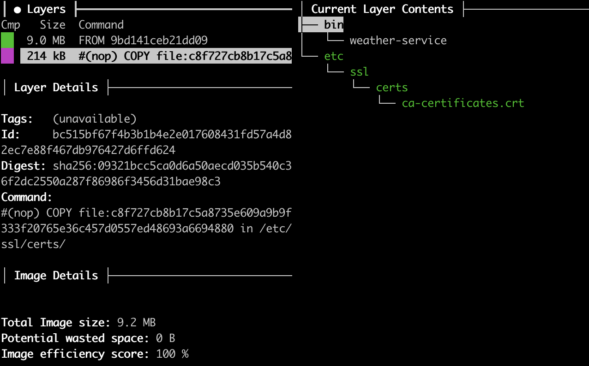

# Weather service

## Part 1: Weather Service

### Technical Choices

**Software architecture**

To create a weather service, I examined the openSenseMap API documentation and wrote a client library. The rest of the
code is in the main package to not overcomplicate the service.

**Cache**

This implementation of the server aggressively caches the result for one minute due to performance considerations.

As a possible improvement, I would update the handler to respect HTTP Cache-Control headers from the upstream API. Also,
I consider it important to provide more information to the downstream clients about caching on the server-side, so that
would be the next improvement on the way to make the application production-ready.

**Metrics**

The service exposes server and client metrics on `/metrics` endpoint in Prometheus format.

**Logging**

I don't see a need for structured logging in this weather-service, but for a larger scale application, this would be a
mandatory feature, in my opinion.

**Tracing**

I did not include a tracing backend in the deployment. The instrumentation library that I used for observability purpose
supports tracing and is ready to plug into
any [modern tracing system](https://opencensus.io/exporters/supported-exporters/go/).

### API

`/health` - returns a static text to check service health
`/temperature` - returns current average temperature for all configured senseBoxes
`/metrics` - application telemetry in a Prometheus format

## Part 2: Kubernetes

The application is wrapped in the Docker container using a multistage build. To minimize the final image, I used
`scratch` as a base image to comply with the requirement to minimize the final docker image size.



As a test environment, I chose minikube as suggested. To make service easily accessible for testing, I decided to use
`ingress` add-on. Since Horizontal Pod Autoscaling is configured to watch average CPU utilization, I enabled
`metrics-server` add-on, which provides these metrics. Please, make sure to enable these addons beforehand.

## Development requirements

To build an application:

* [golang](https://golang.org/dl/) v1 (tested with 1.15)

To deploy to minikube:

* [minikube](https://kubernetes.io/docs/tasks/tools/install-minikube/) with `ingress` and `metrics-server` add-ons
  enabled
* [docker](https://docs.docker.com/install/)
* [kubectl](https://kubernetes.io/docs/tasks/tools/install-kubectl/)

## Deployment

Run the given command in the project root directory and follow the instructions:

```bash
make
```

To see all available options, use `make help`
